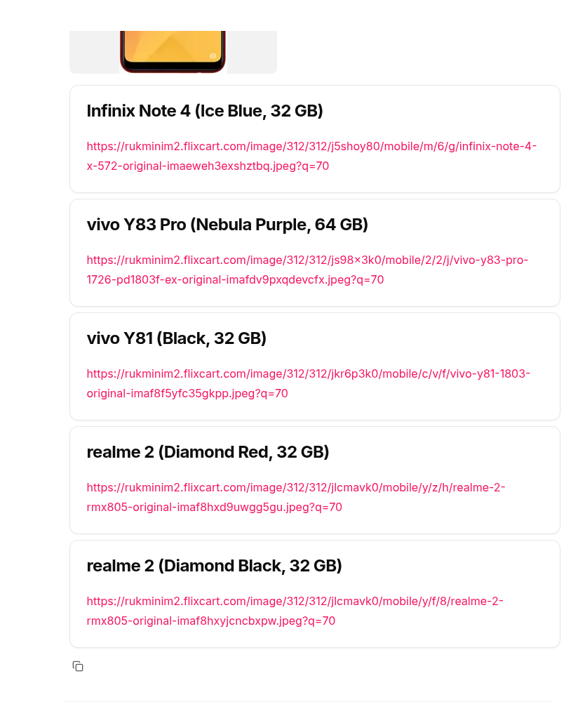

# mobile-recommend

Demo chainlit+langchain app to recommend mobile phones using the [Kaggle mobile-recommendation-system-dataset](https://www.kaggle.com/datasets/gyanprakashkushwaha/mobile-recommendation-system-dataset/data).

<p float="left">
  
  
  
</p>

## Commands

Explore data - open `data_explore.ipynb`

```bash
jupyter notebook
```

Load data into RAG

```bash
python data_loader.py
```

Run ChatBot

```bash
python chatbot.py
```

## Pre-requisites

Setup env

```bash
python3.12 -m venv venv
source venv/bin/activate
```

Install dependencies.

```bash
pip install --upgrade --quiet \
  langchain \
  langchain_community \
  langchain_huggingface \
  lxml[html_clean] \
  bs4 \
  psycopg \
  pgvector \
  pandas \
  numpy \
  ipykernel \
  rich \
  chainlit \
  httpx \
  langchain_openai
```

Run a local postgres database

Pull the image.

```bash
podman pull quay.io/rh-aiservices-bu/postgresql-15-pgvector-c9s:latest
```

Run the postgres database locally.

```bash
podman run -d --name postgres \
-e POSTGRESQL_USER=user \
-e POSTGRESQL_PASSWORD=password \
-e POSTGRESQL_ADMIN_PASSWORD=password \
-e POSTGRESQL_DATABASE=vectordb \
-p 5432:5432 \
quay.io/rh-aiservices-bu/postgresql-15-pgvector-c9s:latest
```

Create the vector extension to hold our embeddings.

```bash
podman exec -it postgres psql -d vectordb -c "CREATE EXTENSION vector;"
```

Run an OpenAI model locally.

```bash
export MODEL=Llama-3.2-1B-Instruct-Q8_0.gguf
export MAX_CTX=6000

python -m vllm.entrypoints.openai.api_server \
  --model /home/mike/instructlab/models/${MODEL} \
  --served-model-name=${MODEL} \
  --quantization gguf \
  --port 8080 \
  --gpu_memory_utilization=0.65 \
  --max-model-len=${MAX_CTX}
```

Check api:

```json
curl -s -X 'GET' http://localhost:8080/v1/models -H 'accept: application/json' | jq .
```

We can run our UI using the chainlit command.

```bash
chainlit run chatbot.py -w --port 8081 --host 0.0.0.0
```
